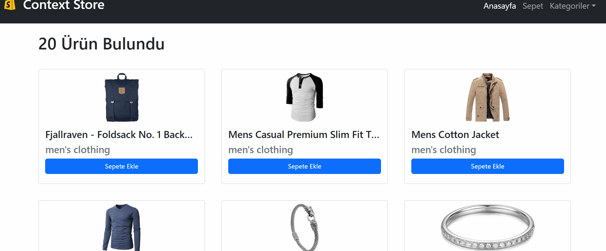

# REACT-ECOMMERCE-WORK

<h4>

Context Store - Sepet Uygulaması
Bu proje, React kullanılarak geliştirilmiş basit bir sepet uygulamasıdır. Uygulama, Context API yapısını kullanarak ürün yönetimi ve sepet işlemlerini sağlar. Kullanıcı, ürünleri sepete ekleyebilir ve toplam fiyatı dinamik olarak güncelleyebilir.

Kullanılan Teknolojiler ve Kütüphaneler
React: Uygulama arayüzü oluşturmak için.
Context API: BasketContext ve ProductContext ile global state yönetimi.
React Router Dom: Sayfa yönlendirmeleri için.
React Toastify: Kullanıcı bildirimleri (toast mesajları) için.
Bootstrap: Responsive ve şık bir tasarım için.
Özellikler
Ürünleri listeleme ve sepete ekleme
Sepetteki ürün sayısını ve toplam fiyatı dinamik olarak güncelleme
Kullanıcı dostu arayüz ve bildirim sistemi
Sayfa yönlendirmeleri ile kolay gezinme

</h4>

<h5>Gif Dosyası Eklendi</h5>

